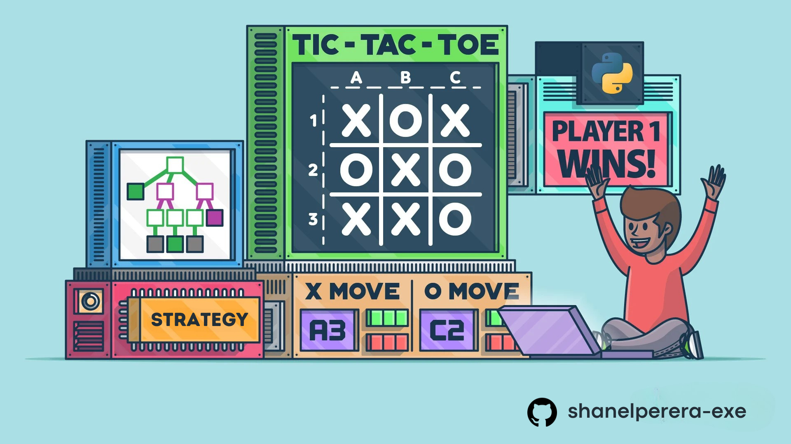

# Tic-Tac-Toe Game

 <!-- Replace with an actual logo or image if available -->

A simple yet strategic command-line Tic-Tac-Toe game built with Python. Play in singleplayer mode against an AI opponent with a basic decision-making strategy or challenge a friend in multiplayer mode. The game features an intuitive input system, a clean CLI interface, and automatic win detection.

---

## Table of Contents

1. [Features](#features)
2. [How to Play](#how-to-play)
3. [Installation](#installation)
4. [Running the Game](#running-the-game)
5. [Game Modes](#game-modes)
   - [Singleplayer](#singleplayer)
   - [Multiplayer](#multiplayer)
6. [Code Structure](#code-structure)
7. [Contributing](#contributing)
8. [License](#license)

---

## Features

- **Singleplayer Mode**: Play against an AI opponent.
- **Multiplayer Mode**: Play against a friend on the same device.
- **Interactive Menu**: Easy-to-navigate main menu and sub-menu.
- **Input Validation**: Ensures valid moves and prevents errors.
- **AI Logic**: The AI can block your moves and attempt to win.
- **Clear Display**: The board is displayed clearly after every move.

---

## How to Play

1. **Choose a Game Mode**:
   - Singleplayer: Play against the AI.
   - Multiplayer: Play against a friend.

2. **Select Your Shape**:
   - In singleplayer mode, choose either `X` or `O`. The AI will take the other shape.
   - In multiplayer mode, Player 1 chooses their shape, and Player 2 is assigned the remaining shape.

3. **Make Your Move**:
   - Enter the square you want to mark in the format `[Row][Col]`. For example, `A1` marks the top-left corner.

4. **Win the Game**:
   - Be the first to get three of your shapes in a row (horizontally, vertically, or diagonally).

---

## Installation

1. **Prerequisites**:
   - Python 3.x installed on your system.

2. **Download the Code**:
   - Clone this repository or download the `game.py` file.

3. **Run the Game**:
   - Open a terminal or command prompt.
   - Navigate to the directory containing the `game.py` file.
   - Run the game using the following command:
     ```bash
     python game.py
     ```

---

## Running the Game

1. **Main Menu**:
   - When you run the game, you'll see the main menu with the following options:
     - `[1] Singleplayer`
     - `[2] Multiplayer`
     - `[E] Exit`

2. **Gameplay**:
   - Follow the on-screen instructions to choose your shape and make moves.
   - The board will be displayed after every move.

3. **Sub-Menu**:
   - After a game ends, you'll be presented with the following options:
     - `[1] Play Again`
     - `[2] Main Menu`
     - `[E] Exit`

---

## Game Modes

### Singleplayer

- Play against an AI opponent.
- The AI uses a simple strategy:
  - It first checks for a winning move.
  - If no winning move is available, it blocks your winning move.
  - If neither is possible, it makes a strategic move (e.g., taking the center or a random square).

### Multiplayer

- Play against a friend on the same device.
- Players take turns entering their moves.

---

## Code Structure

The code is organized into the following components:

1. **Player Classes**:
   - `HumanPlayer`: Handles input and marking squares for human players.
   - `AIPlayer`: Implements the AI logic for singleplayer mode.

2. **Game Logic**:
   - `check_winner`: Determines if a player has won or if the game is a tie.
   - `display_board`: Displays the current state of the board.

3. **Game Modes**:
   - `singleplayer_game`: Manages the singleplayer game flow.
   - `multiplayer_game`: Manages the multiplayer game flow.

4. **Menu System**:
   - `main`: Displays the main menu and handles user input.
   - `sub_menu`: Displays the sub-menu after a game ends.

5. **Utility Functions**:
   - `clear_screen`: Clears the terminal screen for a clean display.
   - `logo`: Displays the Tic-Tac-Toe logo.

---

## Contributing

Contributions are welcome! If you'd like to improve this project, please follow these steps:

1. Fork the repository.
2. Create a new branch for your feature or bugfix.
3. Make your changes and test them thoroughly.
4. Submit a pull request with a detailed description of your changes.

---

## License

This project is licensed under the MIT License. See the [LICENSE](LICENSE) file for details.

---

Enjoy the game! 🎮